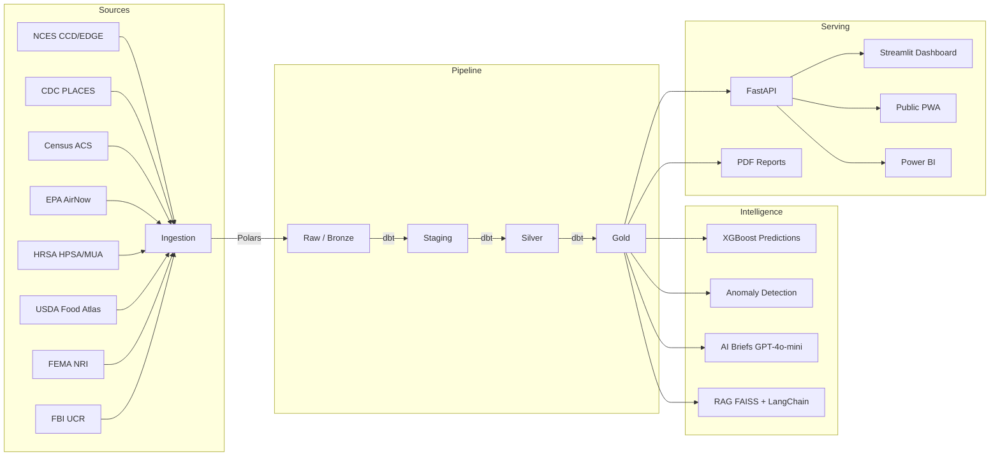

# WellNest

**National Child Wellbeing Intelligence Platform**

WellNest maps child wellbeing for every public school and community in the United States. It fuses 12+ federal data sources -- education, health, environment, safety, and resource access -- into a composite Child Wellbeing Score for 130,000+ schools, with predictive analytics, semantic search over policy documents, and automated insights for grant proposals.

Built in partnership with [ChiEAC](https://chieac.org) (Chicago Education Advocacy Cooperative).

---

## What It Does

- **Scores every US public school** (0-100) across four pillars: Education, Health & Resources, Environment, and Safety
- **Identifies resource gaps** -- which schools lack healthcare access, sit in food deserts, face environmental hazards
- **Predicts trends** -- XGBoost model forecasts next-year proficiency changes
- **Detects anomalies** -- flags schools with unusual score changes for investigation
- **Generates AI briefs** -- GPT-4o-mini writes county-level summaries for grant proposals
- **Answers policy questions** -- RAG pipeline over federal education and health guidelines
- **Produces reports** -- automated PDF county reports for funders and policymakers

## Architecture



## Data Sources

| Source | What | Granularity | Update Frequency |
|--------|------|-------------|------------------|
| NCES Common Core of Data | School directory, enrollment, Title I | School | Annual |
| NCES EDGE | School coordinates | School | Annual |
| CDC PLACES | Health indicators (asthma, obesity, mental health) | County / Tract | Annual |
| CDC Environmental Health | Lead poisoning, asthma ED visits | County | Annual |
| Census ACS 5-Year | Poverty, insurance, demographics | Tract | Annual |
| EPA AirNow | Air Quality Index | Point (lat/lon) | Hourly |
| HRSA HPSA | Health professional shortage areas | County / Area | Daily |
| HRSA MUA | Medically underserved areas | County / Area | Daily |
| USDA Food Access Atlas | Food desert indicators | Tract | Periodic |
| FEMA NRI | Natural hazard risk scores | County | Annual |
| NOAA/NWS | Active weather alerts | Zone / County | Real-time |
| FBI UCR | Crime rates | County | Annual |

## Scoring Methodology

The Child Wellbeing Score (0-100) is a weighted composite of four pillars:

| Pillar | Weight | Key Metrics |
|--------|--------|-------------|
| Education | 30% | Math/reading proficiency, chronic absenteeism, student-teacher ratio, Title I |
| Health & Resources | 30% | Child poverty, uninsured rate, HPSA designation, food desert, MUA |
| Environment | 20% | Air quality, natural hazard risk, environmental health indicators |
| Safety | 20% | Violent crime rate, social vulnerability, property crime rate |

Each raw metric is normalized to 0-100 using min-max scaling (p5/p95 bounds). Higher = better.

| Score Range | Category |
|-------------|----------|
| 0-25 | Critical |
| 26-50 | At Risk |
| 51-75 | Moderate |
| 76-100 | Thriving |

Pillar weights are configurable via `transformation/dbt_project/seeds/pillar_weights.csv`.

Full methodology: [docs/methodology.md](docs/methodology.md)

## Quick Start

### Prerequisites

- Python 3.11+
- Docker and Docker Compose
- (Optional) PostgreSQL client (`psql`)

### Setup

```bash
# clone the repo
git clone https://github.com/chieac/wellnest.git
cd wellnest

# run the setup script (creates venv, installs deps, starts Docker, inits DB)
chmod +x scripts/setup_local.sh
./scripts/setup_local.sh

# or do it manually:
python -m venv .venv
source .venv/bin/activate
pip install -e ".[dev]"
cp .env.example .env  # edit with your API keys
docker compose -f infrastructure/docker/docker-compose.yml up -d
```

### Seed Sample Data

```bash
python scripts/seed_sample_data.py --schools 100
```

### Run Services

```bash
# API server
make run-api
# -> http://localhost:8000/docs

# Streamlit dashboard
make run-dashboard
# -> http://localhost:8501

# Dagster UI
make run-dagster
# -> http://localhost:3000

# or run everything with Docker
make docker-up
```

### Run Tests

```bash
make test           # unit tests
make lint           # ruff + mypy
make dbt-test       # dbt model tests
```

## Project Structure

```
wellnest/
├── ingestion/          # 12 federal data source connectors
│   ├── sources/        # One module per data source
│   ├── utils/          # HTTP client, geo utilities
│   └── schemas/        # JSON Schema data contracts
├── orchestration/      # Dagster assets, schedules, sensors
├── transformation/     # dbt models (staging/silver/gold) + Soda checks
├── ml/                 # Feature engineering, XGBoost, anomaly detection
├── ai/                 # LLM briefs, RAG pipeline, quality validation
├── api/                # FastAPI REST API
├── dashboard/          # Streamlit multi-page analytics dashboard
├── pwa/                # Public web app (vanilla JS + Leaflet)
├── reports/            # PDF county report generator
├── tests/              # pytest suite (unit, integration, API)
├── infrastructure/     # Docker, Terraform (AWS + Azure)
├── docs/               # Architecture, methodology, ADRs
└── scripts/            # Setup, seeding, report generation
```

## API

The REST API serves all data at `http://localhost:8000/api/`. Full docs at `/docs`.

```
GET  /api/health                    # health check
GET  /api/schools                   # paginated school list
GET  /api/schools/{nces_id}         # school detail with scores
GET  /api/schools/{nces_id}/predictions
GET  /api/counties                  # paginated county list
GET  /api/counties/{fips}           # county detail with AI brief
GET  /api/counties/{fips}/schools
GET  /api/search?q=                 # school search
GET  /api/rankings                  # national/state rankings
GET  /api/resource-gaps             # critical resource gaps
GET  /api/anomalies                 # flagged anomalies
POST /api/ask                       # RAG policy Q&A
GET  /api/reports/{fips}/pdf        # county PDF report
GET  /api/stats                     # platform statistics
```

See [docs/api_guide.md](docs/api_guide.md) for full documentation with request/response examples.

## Tech Stack

| Layer | Tools |
|-------|-------|
| Processing | Polars, DuckDB |
| Orchestration | Dagster |
| Transforms | dbt-core + dbt-postgres |
| Database | PostgreSQL 16 + PostGIS 3.4 |
| ML | scikit-learn, XGBoost, LightGBM, MLflow |
| AI | OpenAI GPT-4o-mini, LangChain, FAISS |
| API | FastAPI |
| Dashboard | Streamlit, Plotly, Folium |
| Public App | Vanilla JS, Leaflet.js (PWA) |
| Quality | Soda Core, ruff, mypy, pytest |
| Infrastructure | Docker, Terraform, GitHub Actions |

I chose Dagster over Airflow because the software-defined assets model maps naturally to our dbt workflow, and the local dev experience is significantly better. See [ADR-001](docs/adr/001-dagster-over-airflow.md).

I went with Polars over pandas for the ingestion layer because our NCES CCD files are 2M+ rows and Polars processes them 3-4x faster with a fraction of the memory. The API is also more expressive for the kind of column-level transforms we do. See [ADR-002](docs/adr/002-polars-over-pandas.md).

## Cost

The entire platform runs at **$0-3/month** using free-tier services:

| Service | Tier | Cost |
|---------|------|------|
| PostgreSQL | Supabase Free (500MB) | $0 |
| Dashboard | Streamlit Community Cloud | $0 |
| PWA | GitHub Pages | $0 |
| OpenAI API | Pay-per-use (GPT-4o-mini) | ~$2-3/month |
| MLflow | Local file backend | $0 |

## Known Issues

- **Census API rate limits**: The ACS connector hits the 50-variable-per-request limit, making full tract-level pulls slow. Parallelizing by state helps but isn't perfect.
- **FBI UCR coverage gap**: The 2021 NIBRS transition caused ~40% of agencies to stop reporting. County-level crime data for that year should be treated with caution.
- **CDC PLACES trailing whitespace**: County names in the CDC PLACES API have trailing whitespace. We strip it during staging but it caused a week of debugging when joins silently dropped rows.
- **HRSA download URLs**: HRSA periodically changes their bulk download URLs without redirects. The connector will fail until the URL is updated.
- **Score sensitivity to normalization bounds**: Using national percentiles means a school's score can change meaningfully if the national distribution shifts, even if the school's actual metrics haven't changed. We use p5/p95 clipping to dampen this.

## Contributing

See [docs/contributing.md](docs/contributing.md) for development setup, code style, and PR process.

## License

MIT. See [LICENSE](LICENSE).

